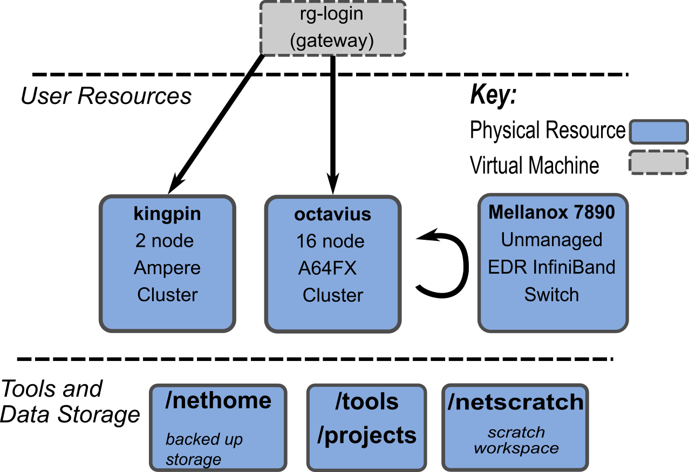

============
Octavius - A64FX Testbed
============

*Last Updated: 10/14/22*

Current Status
--------------

- Octavius has been updated with the latest Cray Programming Environment and Lmod support.

- Note that we no longer have a "login" node, octavius-login. Please just submit jobs from rg-login!

BUGS / Feature Requests
^^^^^^^^^^^^^^^^^^^^^^^

-  No topology file for Slurm

System Specifications and Tools
---------------------------------

+--------------+-------------+-------------+-------------+-------------+
| Queues       | CPU         | Memory (GB) | Networking  | Storage     |
|              |             |             |             | (GB)        |
+==============+=============+=============+=============+=============+
| rg-arm-debug,| `A64FX <htt | 32 HBM2e    | EDR IB      | 330         |
| rg-arm-short,| ps://en.wik |             |             |             |
| rg-arm-long  | ipedia.org/ |             |             |             |
|              | wiki/Fujits |             |             |             |
|              | u_A64FX>`__ |             |             |             |
+--------------+-------------+-------------+-------------+-------------+

Octavius is a 16 node cluster, where each node contains one CPU with
integrated HBM memory, a small amount of SSD storage (340 GB per node),
and a PCIe3 attached EDR InfiniBand card. The specific chassis for each
node is the HPE Apollo 80, previously referred to as the Cray NSP-1 or
"Baymax" platform. While this system is similar to standard Fujitsu
servers, the main difference between these nodes and the Fugaku
supercomputer is that Fugaku also includes a 6D Torus network that is
tied into each CPU core.

Current Tools
^^^^^^^^^^^^^

Note that the Cray compilers are likely to have the best support for
SVE, although GCC 11 and 12 add more low-level support geared
towards A64FX.

.. list-table::
    :widths: auto
    :header-rows: 1
    :stub-columns: 1

    * - Distro
      - Kernel
      - Standard Compilers
      - Other Compilers
      - MPI
      - Miscellaneous
    * - CentOS 8
      - 4.18.0
      - CCE 12.0.1, GCC 8.3, 9, 11.2.0
      - Armclang 22.0.2, Forge 22.0, Clang 10
      - MVAPICH2, OpenMPI 4.0
      - 

**Debuggers**: gdb4hpc 4.7.2, 4.8.1; valgrind4hpc 2.7.1, 2.8.1

**Profilers**: PAPI 6.0, perftools 20.10.0

To use the latest Arm 22.0.2 compilers, you may need to update your modulepath (this will be fixed in future upgrades):

.. code::
   
                   $ module use /net/projects/tools/aarch64/rhel-8/arm-allinea/arm-compiler/22.0.2/modulefiles
   Alternatively:  $ export MODULEPATH=$MODULEPATH:/net/projects/tools/aarch64/rhel-8/arm-allinea/arm-compiler/22.0.2/modulefiles

Tools - Arm Instruction Emulator
^^^^^^^^^^^^^
ArmIE is a DynamoRio front-end that allows for testing and evaluating SVE instructions on hardware that may not support the latest Arm ISA. As an example, you can use ArmIE to instrument your code with "regions of interest" and then print out instruction counts or the numbers and types of different operations (e.g., gather/scatter or load/stores).

For more information on using ArmIE, see this `Getting Started page <https://developer.arm.com/documentation/102190/22-0/Get-started/Get-started-with-Arm-Instruction-Emulator>`__ and `this tutorial page <https://developer.arm.com/documentation/102190/22-0/Tutorials/Analyze-Scalable-Vector-Extension--SVE--applications-with-Arm-Instruction-Emulator?lang=en>`__.

How do I get to Octavius?
-------------------------

As with most CRNCH resources, you need to either log in via the gateway
node, rg-login, or access the system from the campus network via VPN or
an on-campus connection. 

The figure below shows the basic outline of all the resources that you
might interact with on the Arm cluster. Your network shared home is available on 
all nodes listed in this figure, although long compilations and tar/untar operations are 
suggested to use local scratch space on VMs or nodes.

The Mellanox SB7890 provides an InfiniBand connection to all the nodes
within this cluster as well as to flubber3.

   
   RG Arm Server Overview

Compiling for the A64FX
-----------------------

Our installation includes a license for the Cray PE toolset, so you are
encouraged to use this framework to compile your code. Clang and GCC are
also currently available for compilation on the compute nodes.

To compile, you must request a short job (arm-debug queue) since we
can't currently cross-compile on the x86 login node. By
default, these jobs last an hour and are meant to be used to do
compilation and basic testing.

For example:

.. code:: 

   [rg-login]$ sinfo
   PARTITION     AVAIL  TIMELIMIT  NODES  STATE NODELIST
   rg-arm-debug*    up 2-12:00:00      4   idle octavius[1-4]
   rg-arm-short     up 5-00:00:00     16   idle octavius[1-16]
   rg-arm-long      up 15-00:00:0     16   idle octavius[1-16]

   #Request an allocation for one hour
   [rg-login]$ salloc -q rg-arm-debug -t 01:00:00 -N 1 -n 48 --exclusive
   salloc: Granted job allocation 6

   Check that your job has launched.
   [rg-login]$ squeue
   JOBID PARTITION     NAME     USER ST       TIME  NODES NODELIST(REASON)
   6 rg-arm-de     bash  gburdell  R       0:21      1 octavius1

   #Launch an interactive job, run your compilation and testing, and then exit the node
   #Note that the -l flag indicates that the interactive job should load local environment scripts and is needed!
   [rg-login]$ srun --pty bash -l
   gburdell@octavius1:~$ <run_compilation>
   gburdell@octavius1:~$ exit

   #Cancel your job if needed (ie, if you have just used a few minutes)
   [rg-login]$ scancel 6
   [rg-login]:~$$ salloc: Job allocation 6 has been revoked.

To request a specific node you can use the ``-w <nodename>`` flag

.. code:: 

   [rg-login]$ salloc -q rg-arm-debug -t 01:00:00 -N 1 -n 48 --exclusive -w octavius2
   [rg-login]$ squeue
                JOBID PARTITION     NAME     USER ST       TIME  NODES NODELIST(REASON)
                  203 rg-arm-de     bash  gburdell  R       0:04      1 octavius2
   //srun and execute job

Using modules
-------------

By default octavius uses LMOD. Use the standard ``module avail`` and ``module load`` commands. If you don't see all the modules you can try to source our script which will update your MODULEPATH environment variable.

.. code::
   //Shows how to source this script to add all available module paths
   $ . /tools/armhpc/init_modules_slurm_octavius_manual.sh
   $ module avail

This would produce the following output (elided for clarity)::

   --------------------------------------------------------- /opt/cray/pe/perftools/default/modulefiles ---------------------------------------------------------
   perftools-lite-events    perftools-lite-gpu    perftools-lite-hbm    perftools-lite-loops    perftools-lite    perftools-preload    perftools

   ------------------------------------------------------------------------ Cray Modules ------------------------------------------------------------------------   
   PrgEnv-cray/8.1.0           (L,D)    cray-hdf5/1.12.0.2                       (D)      cray-parallel-netcdf/1.12.1.0 (D)

   ------------------------------------------------------ /opt/cray/pe/craype-targets/default/modulefiles -------------------------------------------------------   
   craype-arm-nsp1    craype-arm-thunderx2    craype-network-infiniband

   ---------------------------------------------------------------------- Octavius Modules ----------------------------------------------------------------------   
   cmake/3.21.3    gnu9/9.4.0    hwloc/2.5.0    libfabric/1.13.0    openmpi4-gnu9-backup/4.0.4    prun/2.2    ucx/1.11.2

   ----------------------------------------------------------------------- Arm Compilers ------------------------------------------------------------------------   
   acfl/22.0.2    armie22/22.0    binutils/11.2.0    gnu/11.2.0    gnurt11/11.2.0

   ------------------------------------------------------- /net/projects/tools/aarch64/rhel-8/modulefiles -------------------------------------------------------   
   arm-forge/22.0.2    likwid/5.1.1

Running jobs
------------

Once you have compiled your code, you can request a longer job to do
testing.

.. code:: 

   # Clone the Slurm examples from our internal wiki
   $ git clone https://github.gatech.edu/crnch-rg/rogues-docs.git
   $ cd slurm_examples
   $ sbatch octavius_cpe_mvapich.sbatch
   Submitted batch job 539

Requesting new packages or assistance
-------------------------------------

Please just `submit a
ticket <https://github.gatech.edu/crnch-rg/rogues-docs/wiki/RG-Mailing-Lists-and-Requesting-Help>`__
or ask on our Teams group in the "help-request" channel. We also have a
general arm-hpc discussion channel on our Teams group.

Useful training material
------------------------

The recent `SVE tutorial <https://jlinford.github.io/sc20-hackathon/>`__
by Arm is probably the best source for learning how to use SVE with
A64FX. You can also ask questions in the hackathon channel on the `Arm HPC User Group Slack <https://join.slack.com/t/a-hug/shared_invite/zt-it2g9rlv-aQfZsyV7r3T8jEDDSQKFHg>`__.

`2021 SVE Hackathon for
Ookami <https://gitlab.com/arm-hpc/training/arm-sve-tools>`__

`SVE Hackathon
repo <https://gitlab.com/arm-hpc/training/arm-sve-tools>`__ -also
available under ``/tools/training/arm-hpc`` on RG nodes

Vendor-provided Documents and Resources
---------------------------------------

-  `Cray PE Programming Guide
   (10/20) <https://pubs.cray.com/bundle/HPE_Cray_Programming_Environment_User_Guide_For_Apollo_80_ARM_2009_S8011_Apollo80/page/About_Cray_Programming_Environment_User_Guide.html#>`__
   - a copy of this is also included in the rogues-docs repo.

-  `Arm A64FX Architecture
   Manual <https://github.com/fujitsu/A64FX/blob/master/doc/A64FX_Microarchitecture_Manual_en_1.2.pdf>`__

-  `Arm wiki for optimizing
   HPL <https://gitlab.com/arm-hpc/packages/-/wikis/packages/hpl>`__

-  `Cray Programming Environment Workshop Slides from
   NERSC <https://www.nersc.gov/assets/Uploads/180614+CrayPE+Workshop-NERSC.pdf>`__

