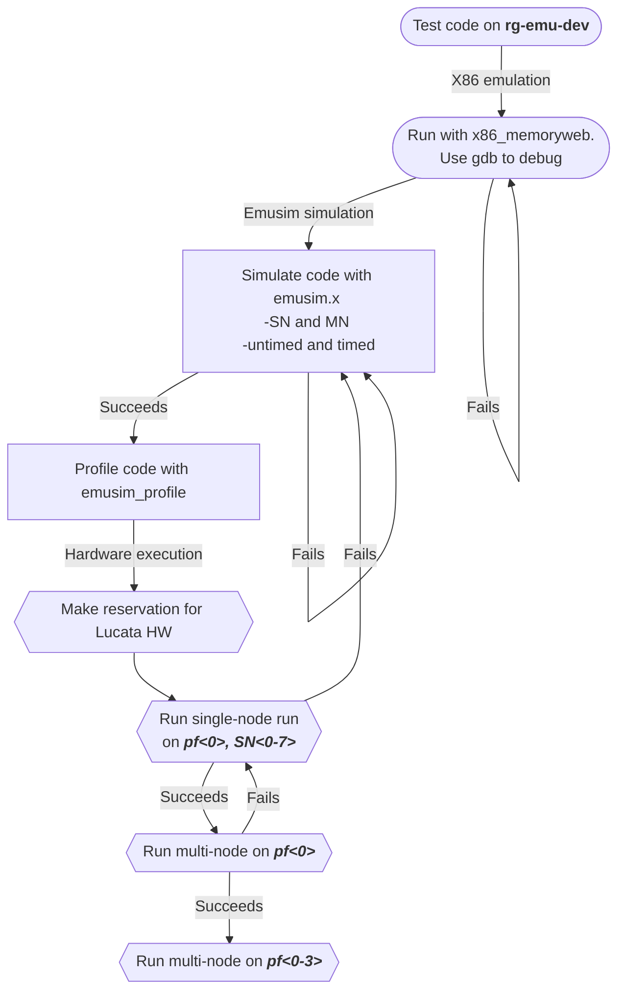

```mermaid
  graph TD;
      A([Test code on <b>rg-emu-dev</b>])--X86 emulation-->B([Run with x86_memoryweb. <br/> Use gdb to debug]);
      B--Emusim simulation-->C[Simulate code with emusim.x <br/>-SN and MN <br/>-untimed and timed];
      B--Fails-->B;
      C--Succeeds-->D[Profile code with emusim_profile];
      C--Fails-->C;
      D--Hardware execution-->E{{Make reservation for Lucata HW}};
      E-->F{{Run single-node run <br/>on <b><i>pf<0>, SN<0-7></i></b>}};
      F--Succeeds-->G{{Run multi-node on <b><i>pf<0></i></b>}}
      F--Fails-->C
      G--Succeeds-->H{{Run multi-node on <b><i>pf<0-3></i></b>}}
      G--Fails-->F
```
