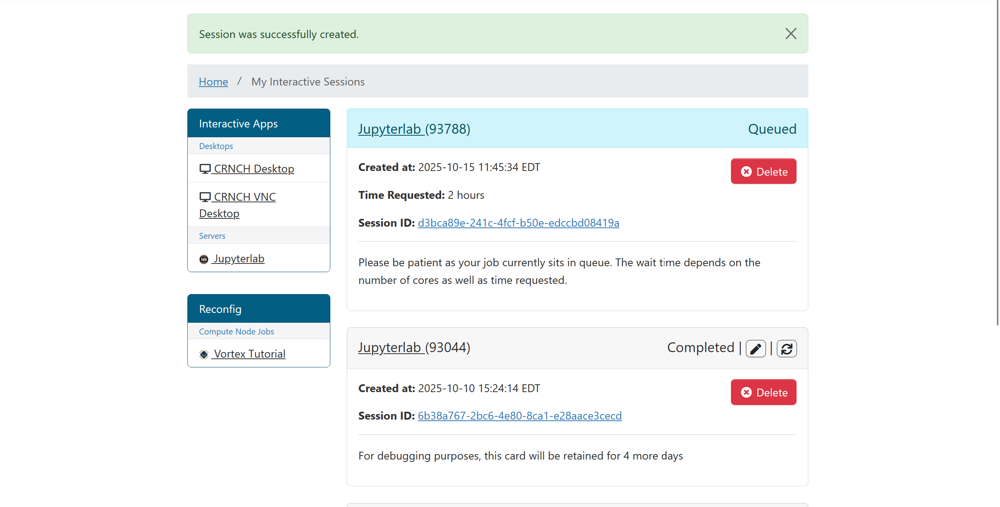
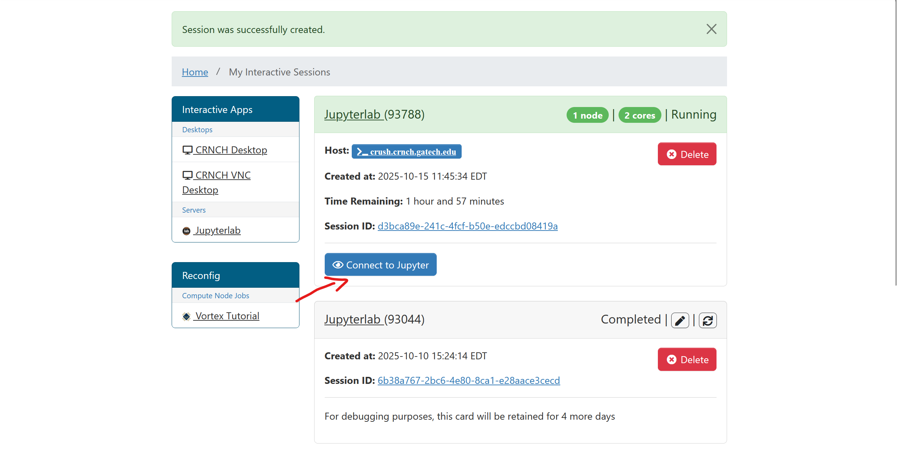
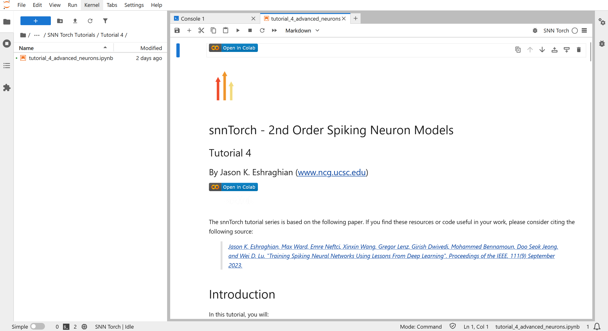
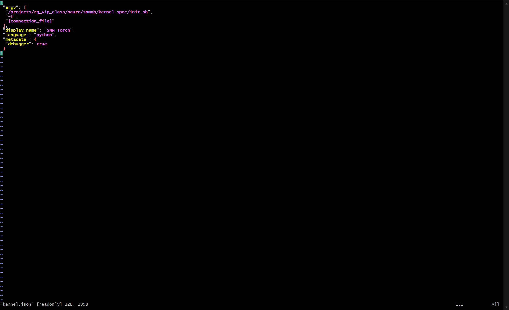
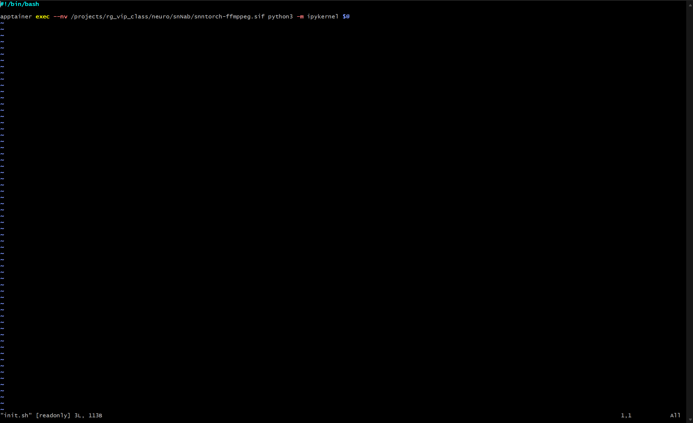
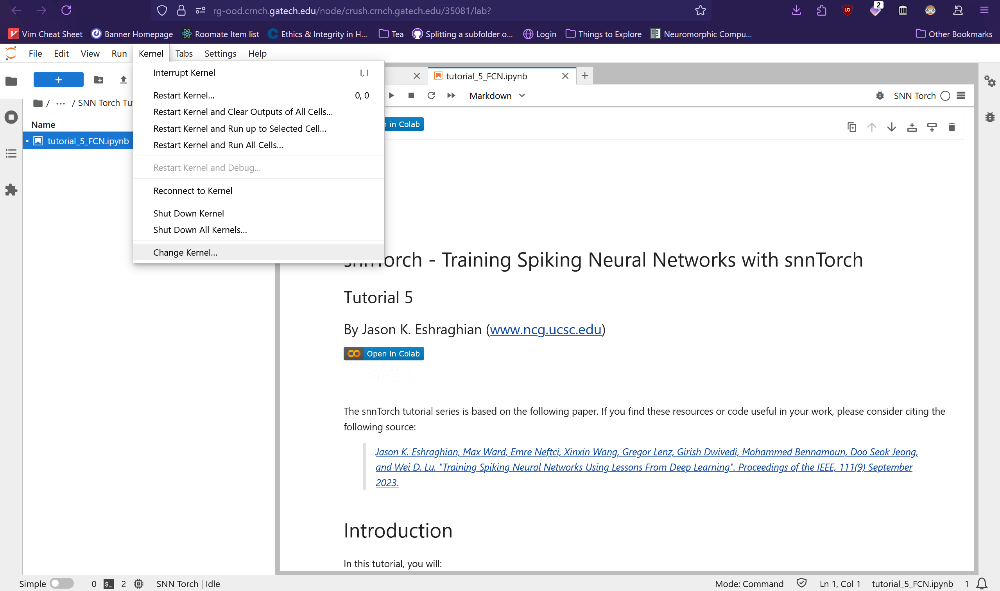
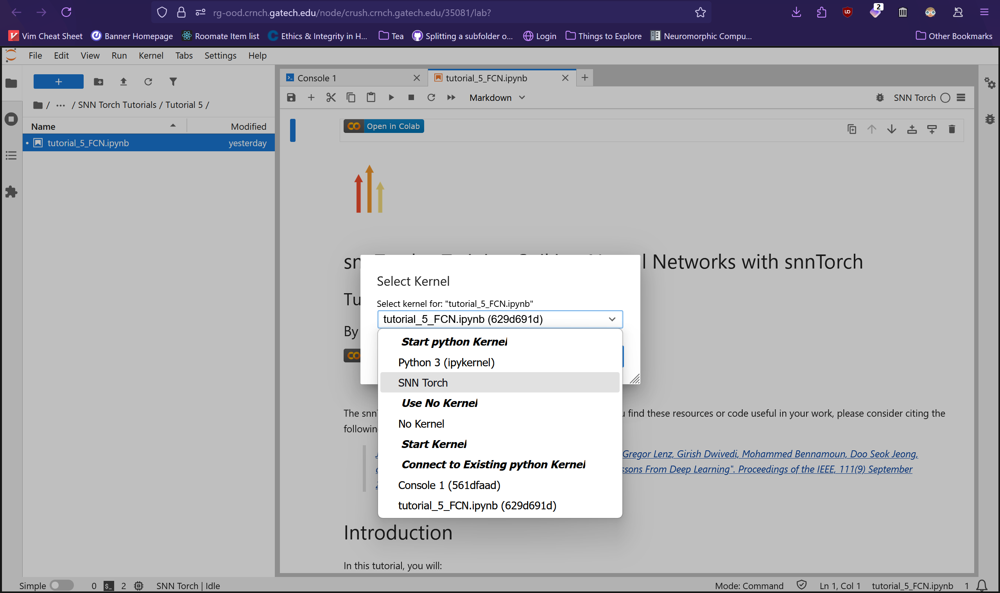

Jupyter Notebooks
=================
JuptyerLab is an interactive notebook that interleaves runnable code with figures, text, and other educational aids.

We suggest using JupyterLab as your interface for neuromorphic, quantum,
and reconfigurable research. PACE has a `nice
article <https://docs.pace.gatech.edu/interactiveJobs/jupyterInt/>`__ on
using Jupyter notebooks we also recommend. Eventually we will support
schedulable Jupyter notebooks via our Slurm scheduler.

Using Open On Demand
--------------------------------------------
We recommend using Open on Demand to run JupyterLab. 
To begin, head to the `CRNCH OOD Login Page <https://rg-ood.crnch.gatech.edu>`
You will need to authenticate with your GT credentials. 

Next, go to Interactive Apps -> JupyterLab

Figure 1: Interactive Apps -> JupyterLab

You will then need to configure the settings for your JupyterLab session. For general use, Dr.Young recommends
the partition be set to **rg-dev** using the **crush** node. 
You can select the hours and CPU settings according to your needs. 
For general use (i.e not ML training, HPC tasks) you should not need more than 1 CPU. 

Figure 2: Configuring JupyerLab Session Settings

Once you have configured the session settings, hit the launch button.

Your JupyterLab should now be queued. You will be taken to a screen that looks like so:

Figure 3: JupyerLab Session Queued

Once your JupyterLab session is ready, its status will be shown. You can connect to the session by clicking *Connect to Jupyter*.

Figure 4: JupyterLab Session Running

Finally you will be redirected to your JupyterLab session! It should look something like this:

Figure 5: Example of a JupyerLab Session

Overview of Starting a JupyerLab session on Open OnDemand:
`CRNCH OOD Login Page <https://rg-ood.crnch.gatech.edu>` -> Interactive Apps -> JupyterLab -> JupyerLab Settings -> Session Queue -> Session Running -> Connect to JupyterLab

Running JupyterLab through Apptainer Container
==============================================
Apptainer containers are an enormously useful to standardize program dependencies. Unfortunately it is not obvious how to run Jupyter notebook code through an Apptainer. 
The solution is to use `Jupyter kernels <https://docs.jupyter.org/en/stable/projects/kernels.html>`.
The kernel is an interface between the Jupyter notebook and the programming language. Given the notebook code to run, 
the kernel runs the code and then helps display any outputs: text, graphs, etc. 
[ipykernel](https://github.com/ipython/ipykernel) is Jupyter's built in python kernel, which itself is built on top of [IPython](https://ipython.org/). 
To use run our (python) code through an Apptainer, we will build an additional layer on top of IPython.
We use as example a kernel created by Dr. Jezghani for the neuromorphic subteam.

// TODO: ADD LINK
[Link]()

Inside our kernel-spec directory are two files. ``kernel.json`` and ``init.sh``. Let's begin with kernel.json:

Figure 6: kernel.json

This file is relatively self explanatory, aside from "argv". Note that we specify our language as python. 
"argv" is a list of command line arguments that will be passed to ``init.sh``. 

Let's now look at ``init.sh``:

Figure 7: init.sh

This file is really only one command, [``apptainer exec``](https://apptainer.org/docs/user/main/cli/apptainer_exec.html). ``--nv`` enables nvidia support. ``/projects/rg_vip_class/neuro/snNab/snntorch-ffmppeg.sif`` is the singularity Apptainer file. 
If you look at the specification for ``apptainer exec``:
``apptainer exec [exec options...] <container> <command>``
``python3 -m ipykernel $@`` is the command that is run inside of the container. ``python3 -m ipykernel`` runs the ipykernel module.
But was is ``$@``? [Here](https://unix.stackexchange.com/questions/660122/what-is-in-bash) is a good stack overflow thread on the ``$@`` special parameter. Remember "argv" in kernel.json. 
The first element of argv: "/projects/rg_vip_class/neuro/snNab/kernel-spec/init.sh" is the name of the script for our kernel to run, in this case, ``init.sh``. 
The next two elements of "argv" are command line arguments we wish to pass into ``init.sh``. ``$@`` expands out these arguments passed into the script. In effect, the command that will be run is:
``apptainer exec --nv /projects/rg_vip_class/neuro/snNab/snntorch-ffmppeg.sif python3 -m ipykernel -f {connection_file}``
connection_file is provided to us by our JupyterNotebook. Ipykernel still acts as the interface between our Jupyter notebook and the language, but now it is running inside of our specified Apptainer image.
It will now have access to all of the libraries and other dependencies that we included in the image. 

Select Kernel in JupyterNotebook
================================
To select your new kernel inside of your JupyterNotebook, go to Kernel -> Change kernel and then select the kernel that you'd like to use.

Figure 8: Kernel -> Change kernel

Figure 9: Selecting SNN Torch kernel

