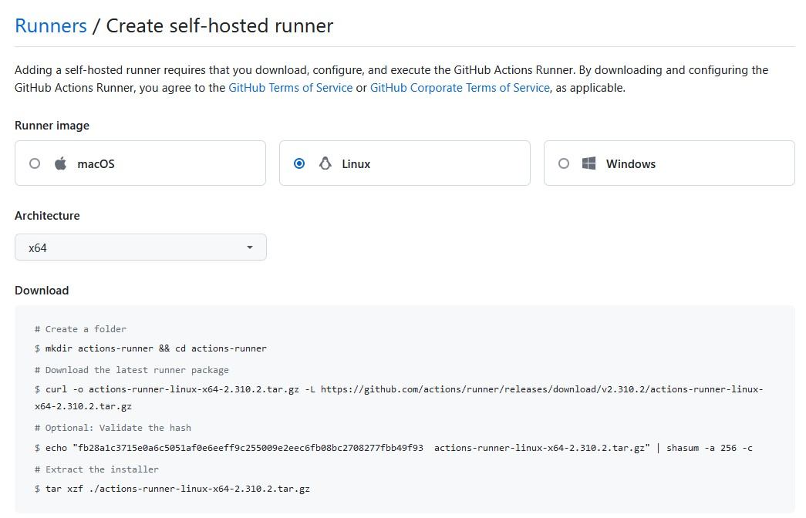
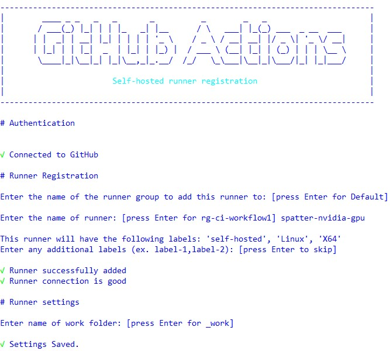
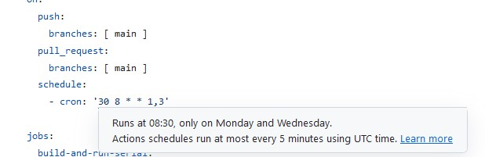
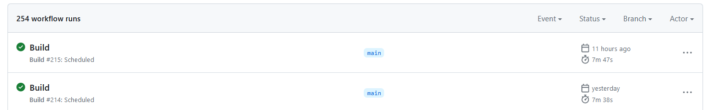

=============
CI/CD Support
=============

We have set up a new VM, `rg-ci-workflow1`, which can be used to host Github runners that launch Slurm jobs on the novel architecture within the Rogues Gallery. 

Supported Platforms for CI Runners
----------------------------------
In theory, we can support any target architecture that is addressable via Slurm. However, we would suggest that the following architectures might be good targets for your self-hosted runners. 

- NVIDIA GPUs (A30, A100, H100)
- AMD GPU (MI210)
- RISC-V (SiFive Unmatched)
- Arm (A64FX, Ampere)

Getting Started
---------------
We recommend that you review Github's documentation on `self-hosted runners <https://docs.github.com/en/actions/hosting-your-own-runners/managing-self-hosted-runners/about-self-hosted-runners>`__.

1) Test that your code can run under a standard Slurm job using your desired CRNCH resource. As part of this first step, you should check that your normal tests complete for your application on the target node.      

2) Go to your repos page and create a new Linux-based self-hosted runner. 
      - As an example, your runner page might be at `https://github.com/organizations/<yourorg>/settings/actions/runners/new`.  
3) SSH to the `rg-ci-workflow1` VM, which is used primarily to test and host self-hosted runners. 
4) Create a folder under `/projects/ci-runners/<your_project>` for your specific runner. Download your runner files to this directory

5) Configure and run the `run.sh` workflow script.
    - Note that run.sh will only listen for connections while your session is open. You would need to use `nohup` or `tmux` to keep it running for a longer period of time.

.. code:: 

      //Use run.sh to test that your self-hosted runner works with the local cluster steup. 
      [/projects/ci-runners/spatter-cuda/actions-runner/]$ ./run.sh

6) Go to your workflow and add a new self-hosted runner section. 
7) Create an SBatch file to launch and run your tests on your target architecture.
    - We use Slurm SBatch files to launch jobs on targeted architecture nodes. See the table below for example build.yml and sbatch files
    - Update the logfile name in the sbatch file to point to your runner project directory, ie, `/projects/ci-runners/<your_project>/logs/runner-cuda-test-%j.out`.
    - Note that your sbatch file needs to live within your repo, so please don't put any private key or other information in the batchfile.

8) Initiate a run of your new workflow with the self-hosted runner.
    - Check that the sbatch job runs and completes correctly.
    - It may take up to 10 minutes to run for CUDA jobs. 

Installing Your Self-hosted Runner as a Service
-----------------------------------------------
Once you have verified that your runner completes correctly, RG admins can help to install it as a service. Please submit a ticket to get your runner added as a service!

.. code::

      //A root user must run this command for you
      [../actions-runner/]$ sudo ./svc.sh install

      // Check that your service is installed and running
      rg-ci-workflow1>$ systemctl list-units | grep action
      actions.runner.hpcgarage-spatter.cuda-runner.service                                      loaded active running   GitHub Actions Runner (hpcgarage-spatter.cuda-runner)

.. note::

    Github runners will deregister themselves if a job is not run every 14 days. To avoid this, we encourage you both to register your runner as a service and also set up your Github workflow file to run on a schedule of once a week (see example below).

Scheduling Github actions to run on a schedule
----------------------------------------------
Github workflows can be executed when code is pushed to the repo, but you can also specify that a service or runner executes a job every so often using `schedules <https://docs.github.com/en/actions/using-workflows/workflow-syntax-for-github-actions#onschedule>`__. 

These jobs use cron-style syntax where you specify the 1) minute 2) hour 3) day of the month 4) month of the year and 5) day of the week. Using a `*` specifies that the job runs every minute/hour/day, etc. Learn more about cron syntax by looking at cron expression generators like this one `<https://crontab.cronhub.io/>`__.

One nice feature of the Github web editor is that it will help you interpret your schedule when you mouse over the specific cron-related string. You can use this tool to check that your expected schedule matches what you expect. We suggest that you run your self-hosted runner *once a week* to make sure it doesn't deregister itself.

To see if your scheduled event is working, you can check the output of your Github actions and check for a "Scheduled" build event

Examples of Projects Using RG Self-Hosted Runners
-------------------------------------------------

.. list-table:: 
    :widths: auto
    :header-rows: 1
    :stub-columns: 1

    * - Project Name
      - Target Arch
      - Workflow build.yml
      - CRNCH RG Jobfile
    * - Spatter
      - NVIDIA GPU
      - `Spatter build.yml <https://github.com/hpcgarage/spatter/blob/main/.github/workflows/build.yml>`__
      - `Spatter Batchfile <https://github.com/hpcgarage/spatter/blob/main/tests/misc/run-crnch-cuda.sh>`__

Resources
^^^^^^^^^^^^^^

- `Setting up Github self-hosted runners <https://docs.github.com/en/actions/hosting-your-own-runners/managing-self-hosted-runners/about-self-hosted-runners>`__
- `Self-hosted runner services <https://docs.github.com/en/actions/hosting-your-own-runners/managing-self-hosted-runners/configuring-the-self-hosted-runner-application-as-a-service>`__
