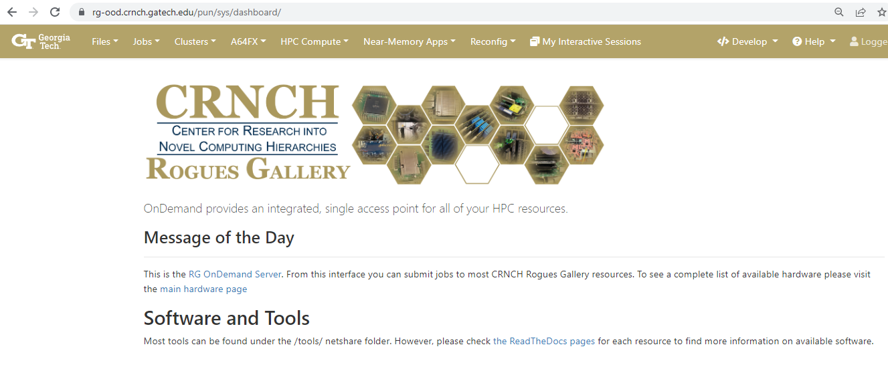
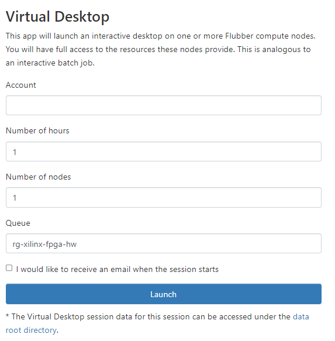
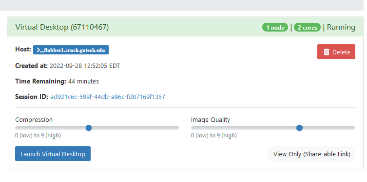
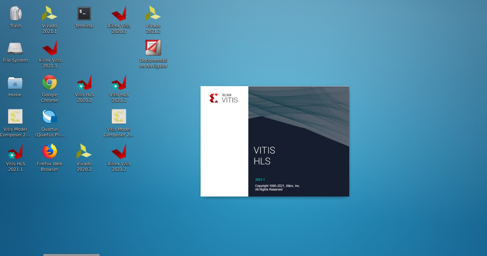
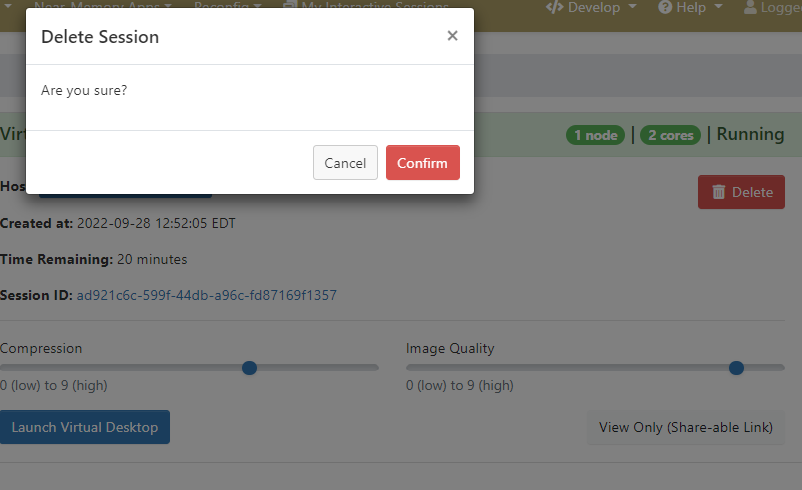
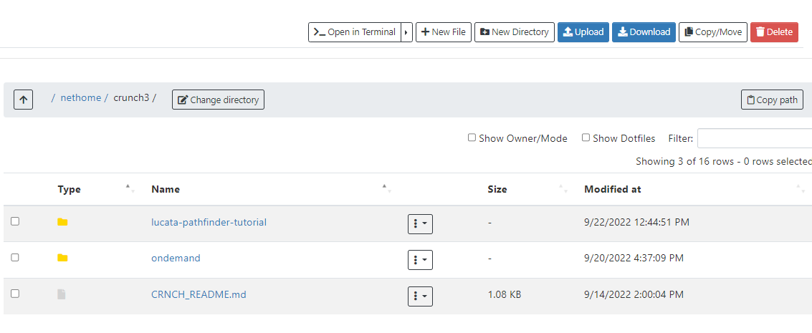

=============
Open OnDemand
=============

With the arrival of Slurm scheduling for most resources, we have switched to using Open OnDemand (sometimes called OOD) for GUI and notebook interfaces. `Open On Demand <https://openondemand.org/>`__ provides a web browser interface from which users can launch GUI-based applications including Jupyter notebooks, file browsers, command-line terminals, and VNC-based applications. We encourage you to review the `general PACE instructions <https://docs.pace.gatech.edu/ood/guide/>`__ for more details on what you can do with OOD - this page covers RG-specific tasks that you might find useful. 

.. note:: 

OOD depends on using Slurm to reserve parts of nodes. This means that you will need to predict how long your job will take and how many cores your job needs. A compile that may take 3-4 hours should be run with a job that lasts at least that long. 

Logging In
----------

You should be able to log into the CRNCH RG Open OnDemand portal using your GT login and password with rg-ood.crnch.gatech.edu. If you are a GT employee or student, you will also need to use two-factor authentication (i.e., Duo) with your login while guests are not required to use two-factor login. Once you log in, you will be greeted by the login portal which has several tabs at the top of the webpage. 

VNC for GUI applications
------------------------
We have switched to using `VNC <https://gt-crnch-rg.readthedocs.io/en/main/general/using-gui-with-vnc.html>`__ instead of other tools like x2go because it is easier to schedule and works better with Open OnDemand. 

.. note:: 

Like with x2go, your VNC session runs with a VNC server and will remain running for the length of your scheduled job, even if you need to close your laptop or the session tab. You can go to ``Interactive Sessions`` to resume any running job. 

To run a job on one of the reconfigurable server nodes, please select ``Reconfig-->Virtual Desktop``.

 
 On the next page, you will need to specify the length of your job (we suggest 1-2 hours for non-compilation jobs), the number of cores to use (2-4 unless doing a parallel compile), and the queue (rg-xilinx-fpga-hw for flubber1 or rg-intel-fpga-hw for flubber2). 

 
 Once the job starts, you can change the image quality and compression settings for the VNC session to make your connection faster. Note that higher graphical quality may result in some lag on slower network connections. Click on ``Launch Virtual Desktop`` to start your VNC session.

 
 You can then run applications from the terminal within the XFCE window or by using desktop icon launchers to launch GUI applications.

When you are completely finished with your VNC job, you can go back to your Interactive Sessions tab and select "Delete" to kill the VNC server and your job.

Jupyter Notebooks
-----------------------

To use Jupyter noteboks on our notebook server, hawksbill, you can select ``Near-memory Apps-->Jupyter Notebook``.

.. figure:: ../figures/general/ood/rg_ood_nearmemory.png
 :alt: OOD Jupyter Near-memory Tab

You will then need to specify the time for your job (up to 12 hours) and the number of cores. We typically recommend starting with 2 cores unless you know you are running a parallel application from within your notebook. 

.. figure:: ../figures/general/ood/rg_ood_launch_job.png
 :alt: OOD Jupyter job

Once the job launches, you can select ``Connect to Jupyter`` to connect to the Jupyter notebook interface.

.. figure:: ../figures/general/ood/rg_jupyter_notebook_interface.png
 :alt: OOD Jupyter interface

You can then work within a Jupyter notebook to complete your project or experiments. Remember to save your notebook when you are finished and "Halt" when switching to other notebooks to save CPU resources.

.. figure:: ../figures/general/ood/jupyter_nb01_screenshot.PNG
 :alt: OOD notebook
 
You can also open a terminal from the Jupyter notebook environment, which is useful if you are mixing C or other code in your notebook. The `Lucata Pathfinder Tutorial <https://github.com/gt-crnch-rg/lucata-pathfinder-tutorial/tree/main/code>`__ has several examples of C-based code that can be run from the notebook or on the command line.  

.. figure:: ../figures/general/ood/jupyter_terminal_tab_1.png
 :alt: OOD Jupyter Terminal Open

.. figure:: ../figures/general/ood/jupyter_terminal_tab_2.png
 :alt: OOD Jupyter Terminal

Terminal from the Browser
-------------------------

To open a terminal on the main gateway node, rg-login.crnch.gatech.edu, you can select ``Clusters-->Rogues Gallery Shell Access``.

   
File Browser
------------
Open OnDemand includes a file browser, that you can use to open and investigate certain files in your netshare folder and your netscratch folder.

   

Troubleshooting
-----------------------

1) When launching a new job, the job may fail to launch with an error about writing state.
    - Try to relaunch the job. This may just be related to small OOD bugs.
    
2) When opening a VNC or Virtual Desktop session, you get the error "Failed to establish a websocket connection".
    - Clear the cache in your web browser, relogin and try to launch the job again. Specifically you may need to clear your cookies for gatech.edu domains. 

More Resources
^^^^^^^^^^^^^^

- `Using OOD for the Lucata Pathfinder tutorial <https://github.com/gt-crnch-rg/lucata-pathfinder-tutorial/blob/main/Tutorial-Instructions.md>`__
- `PACE OOD Guide <https://docs.pace.gatech.edu/ood/guide/>`__ - PACE's Open OnDemand instructions
- `Open OnDemand Discourse <https://discourse.openondemand.org/>`__ - community discussions and a good place for Q&A
