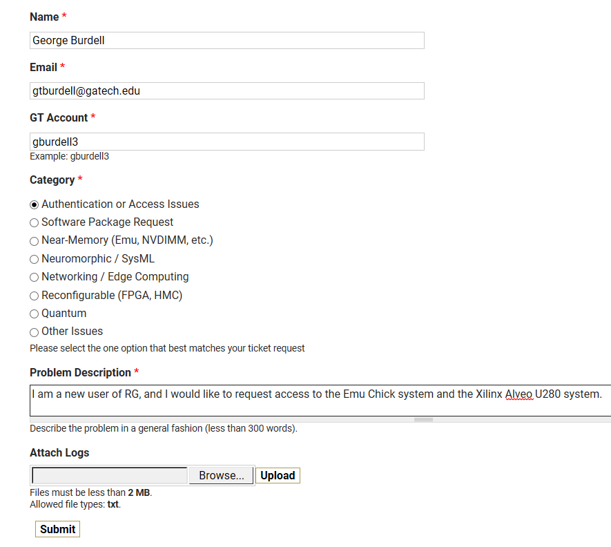
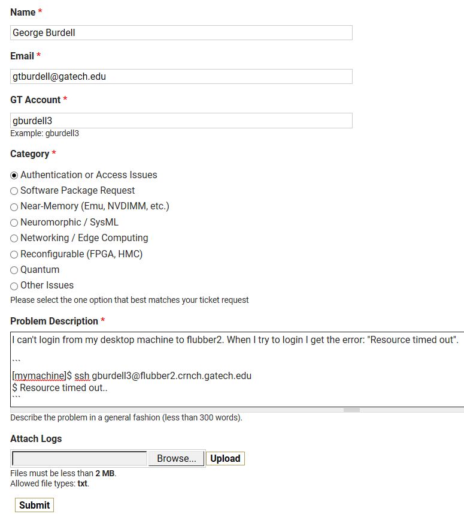
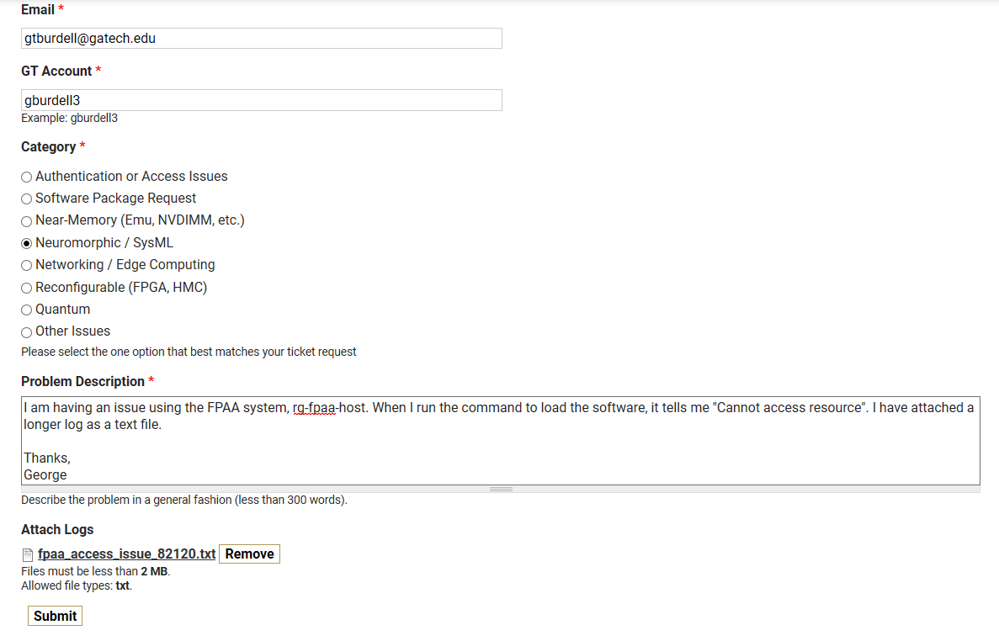

====================================
Rogues Gallery Help Webform Examples
====================================

This page shows some simple examples of how to fill out the [help ticket webform](https://crnch-rg.cc.gatech.edu/crnch-rg-help/) to request certain features. Your ticket should have at the minimum:

1. What machine(s) are you experiencing the problem on?
2. What is some short output from the command being run and the error output? If the output is longer or GUI based you can also share a logfile as text using the upload button. 

Requesting access to new CRNCH resources
----------------------------------------
The webform can be used to ask for access to new resources like the Emu Chick or FPGA devices. Using the form allows us to easily generate a ticket to add you to the correct permissions group. 

   
Requesting help with a login or authentication issue
----------------------------------------------------
You can use the blank entry space to detail issues in an easy fashion. 

Including logfiles with your ticket
-----------------------------------
For more complicated issues, it is good to include a log that describes a "minimum working example". That is the smallest piece that you can test or the most relevant output (usually the first and last parts of a long output error).

