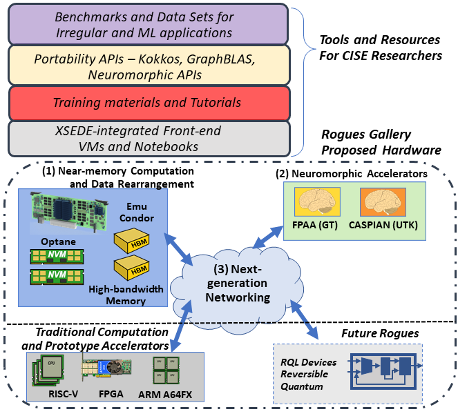
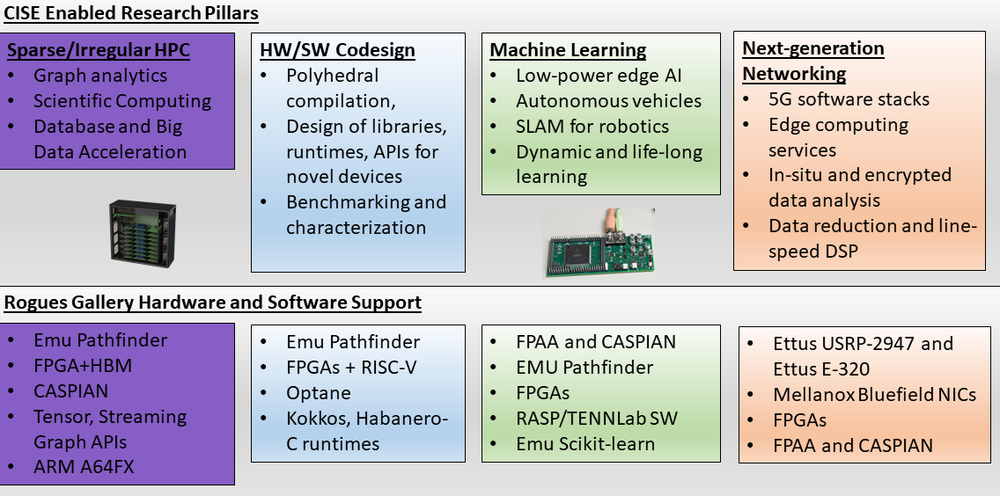

============
What is the Rogues Gallery?
============
The Rogues Gallery is a shared,open-access testbed run by the Center for Research into Novel Computing Hierarchies (CRNCH) at Georgia Tech. 
This testbed is focused on supporting "post-Moore"architectures, tools, and software. The RG testbed is currently funded by NSF's Community CISE Research Infrastructure (CCRI) program as NSF
award #\ `2016701 <https://www.nsf.gov/awardsearch/showAward?AWD_ID=2016701>`__ starting in September 2020. The Rogues Gallery was started as a Georgia
Tech specific testbed in 2017, and it has since grown to close to 100 internal and external users.

What is in the Rogues Gallery?
==============================

Currently the Rogues Gallery has support for devices in the near-memory,
traditional HPC, reconfigurable, and neuromorphic spaces. The CCRI grant
will enable us to expand that to networking and quantum-related testbed
equipment. The figure below shows a high-level overview of what the
Rogues Gallery testbed looks like.

This testbed is meant to enable several CISE-specific research pillars
including: 1) sparse and irregular HPC 2) hardware and software codesign
3) novel machine learning systems 4) and edge computing and
next-generation networking. |RG Enabled Research Pillars|

Who are the users?
==============================
Anyone in the US can request an account for the CRNCH Rogues Gallery testbed with priority for
CISE researchers, students, and industry partners.
