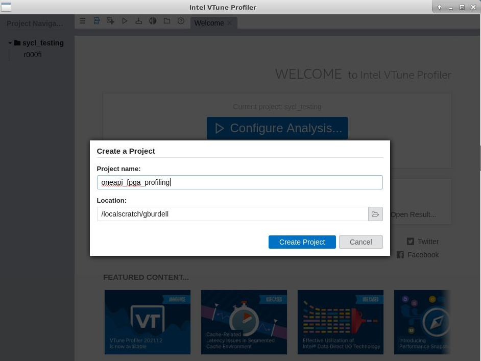

GUI Applications with x2Go (Legacy)
==================================

.. note::

x2go is considered a legacy option for CRNCH RG as we migrate to use `Open OnDemand <https://gt-crnch-rg.readthedocs.io/en/main/general/open-on-demand.html>`__. We strongly encourage you to use VNC instead of x2go or test out Open OnDemand for your application.

Here we cover how to use x2go client on the CRNCH Rogues Gallery machines to access and manipulate GUI-based applications. As an alternative to using VNC, X2go is an open-source implementation of `NoMachine or NX <https://en.wikipedia.org/wiki/NX_technology>`__ that requires fewer steps to setup and use.

How do I quickly get started using X2go on CRNCH resources?
-----------------------------------------------------------

As a baseline just to get started you need to do the following:

1. Download an x2go client from the `official
   webpage <https://wiki.x2go.org/doku.php/download:start>`__. Note that
   MacOS uses XQuartz to help render the GUI if you have not already
   installed it.

2. Open the x2go client and put in the destination address you want to
   use with a GUI client. For our purposes, we will select
   ``flubber2.crnch.gatech.edu``. We recommend using XFCE as the default
   window manager. Your login is your GT username and your password is
   your standard RG password.

.. figure:: ../figures/general/x2go/x2go_client_login_1.png
   :alt:

1. You may want to change the size of the GUI window and also turn off
   the sound (media tab - not shown here).

.. figure:: ../figures/general/x2go/x2go_client_login_2.png
   :alt: 

1. If you are on **not** on campus VPN, you need to add the "proxy
   setting" for the X2go client to use rg-login.crnch.gatech.edu as your
   login or jump host proxy. Set the proxy to use the same login and
   password as the x2go server.

.. figure:: ../figures/general/x2go/x2go_client_login_proxy.png
   :alt: 

1. Click OK to save your session, and then you will need to click on the
   seal icon to start your session. Enter your GT passport username and
   password. If successful, a new terminal will pop up.

.. figure:: ../figures/general/x2go/x2go_client_login_3.png
   :alt: 

1. After 15-30 seconds you should see a default blue GUI background. You
   can then open a terminal to run GUI applications or click on the
   existing Desktop icons for Xilinx tools.

.. figure:: ../figures/general/x2go/x2go_client_terminal.png
   :alt: 

As an example, if you source the OneAPI tools environment script in a
terminal (or have it sourced in your .bashrc) you can then launch the
GUI version of vTune for profiling.

1. When you are done with your session, go back to the main client
   windows and click the circle button marked "Terminate". This will end
   your session rather than just pausing it. We reserve the right to end
   X2Go sessions if they are running longer than a day without any user
   interaction.

.. figure:: ../figures/general/x2go/x2go_client_pause_quit.png
   :alt: 

Troubleshooting
---------------

If you are having trouble copying and pasting from your local desktop to
the x2go client session, try disabling the primary clipboard in the x2go
client settings (Options-->Settings-->X.Org Server Settings-->Do not use
primary clipboard). Make sure to fully restart your x2go client (kill
via command-line, if needed) to see the change.

x2Go Installation
------------

On Ubuntu, installation is relatively easy. You may want to install
xfce-desktop if you have not already done so for VNC sessions.

.. code::

   sudo apt-get install xfce-desktop x2goserver x2goserver-xsession

On Redhat 7 run the following:

.. code::

   sudo yum groupinstall xfce
   sudo dnf install x2goserver x2goserver-xsession

Redhat 8 requires the use of EPEL to get XFCE as an available desktop -
see `here <https://forum.xfce.org/viewtopic.php?id=13412>`__.

.. code::

   //Install EPEL and XFCE
   sudo dnf -y install epel-release
   sudo dnf -y groupinstall Xfce
   sudo dnf install x2goserver x2goserver-xsession
