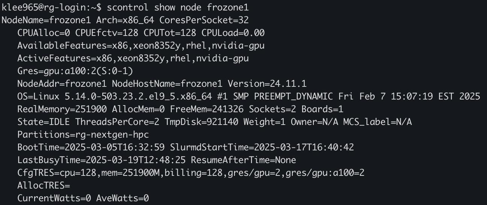
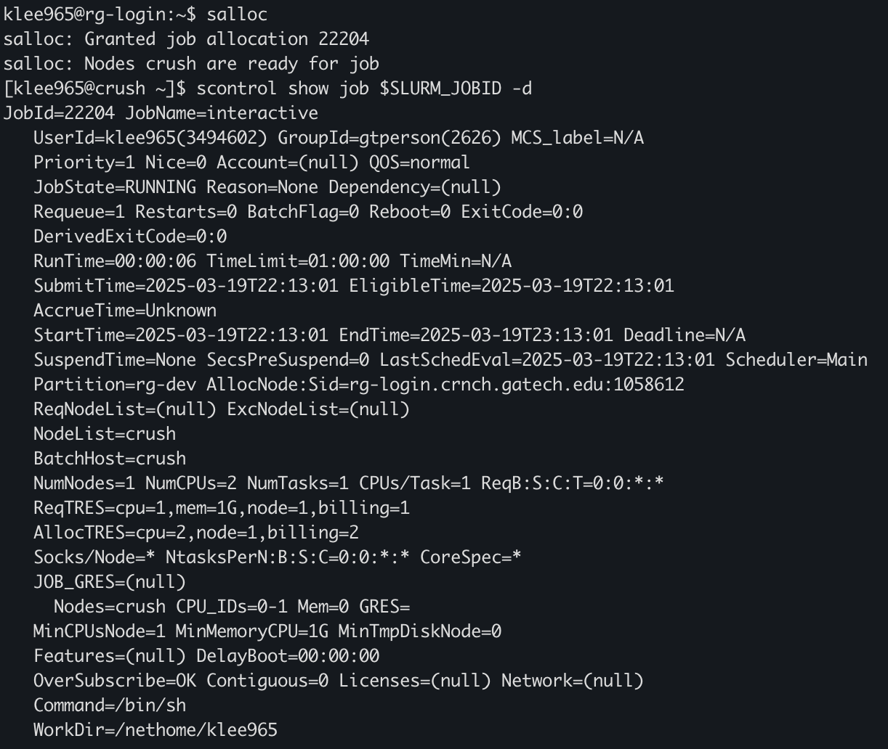

===========================
Using Slurm with RG Systems
===========================

See `this page <https://gt-crnch-rg.readthedocs.io/en/main/general/using-slurm-examples.html>`__ with examples of how to use Slurm to request jobs on the testbed!

What is Job Scheduling and Why Do We Use It?
--------------------------------------------
Job scheduling helps us to manage a limited number of novel resources with an active 
userbase while guaranteeing the resources you need to finish your job. While job scheduling
is currently most used for homogeneous cluster resources like PACE's `Phoenix cluster <https://docs.pace.gatech.edu/phoenix_cluster/gettingstarted_phnx/>`__
we have focused on using it for the Rogues Gallery to provide fair access to all users and to
help document how specific resources are utilized. 

We use `Slurm <https://slurm.schedmd.com/overview.html>`__ as our job scheduler and resource manager 
as it is widely used by large cluster installations including Cori and Perlmutter at NERSC, 
Frontera at TACC, and near-term systems like Frontier at ORNL. Since the Rogues Gallery has a large
diversity of resources, we have many different *workflows* depending on the novel architecture that
is targeted.

What Slurm queues are available?
--------------------------------

You can check the current status of all queues by using ``sinfo`` on any RG node. It will also show
the state of the resource where ``idle`` means that the node is available for a new job, ``alloc``
indicates that the node is fully allocated so that no new jobs will run. ``mixed`` means that only
some of the hardware is allocated to a user, so it may be able to accept new jobs. The following table
shows the currently available nodes within the cluster.

Slurm Partitions
----------------
.. list-table:: 
    :widths: auto
    :header-rows: 1
    :stub-columns: 1

    * - Queue Partition
      - Time Limit
      - Nodes
      - Node List
      - Notes
    * - rg-nextgen-hpc
      - 24 hours
      - 38
      - dash[1-4],flubber[6-7,10],flubber10-bf2-[1-4],frozone[1-2],hopper[1-4],instinct,johnny-rv5-[1-2,5],kingpin[1-2],octavius[1-8],quorra[1-2],rg-uwing-[1-2],violet[1-2],violet1-bf3-1
      - General HPC nodes with a variety of GPUs and SmartNICs       
    * - rg-neuro
      - 24 hours
      - 7
      - brainard-[1-3]cable1,magpie5-1,rudi[2-3]
      - NVIDIA Jetson and related neuromorphic platforms
    * - rg-fpga
      - 24 hours
      - 7
      - flubber[1-5,8-9]
      - Hosts Intel and Xilinx FPGAs

To get per node information, you can use ``scontrol show node [nodename]`` for example, we can query information about
frozone1

This includes OS and hardware information about the node of interest. ``CfgTRES`` indicates how much resources are available,
and ``AllocTRES`` is how much is currently allocated in the server. Frozone1 in the above figure was idle at the time so 
``CfgTRES`` and ``AllocTRES`` shows that it is fully available.

``scontrol show job [jobid] -d `` is a useful command that shows CPU id and Gres (Generic Resource) id as well. Since Rouges Gallery
is a testbed of novel architectures, here it has many instances of Gres, which may be GPUs, FPGAs, etc.

``scontrol show part`` shows default allocation of memory per core, default time, etc. for each partition.

How do I get started with Slurm on RG?
--------------------------------------
We suggest that you first check out the following Slurm "Quick Start" resources from LLNL
if you have not used a batch submission system before. Find them `here and below in the resources section <https://hpc.llnl.gov/banks-jobs/running-jobs/slurm-quick-start-guide>`__.

Then please check out our RG Slurm Examples page and the RG Workflows page for architecture of interest and specific commands to run for these systems.

- `RG Slurm Examples <https://gt-crnch-rg.readthedocs.io/en/main/general/using-slurm-examples.html>`__
- `RG Workflows <https://gt-crnch-rg.readthedocs.io/en/main/general/rg-workflows.html>`__

Here we go through some basic examples and uscases.

So far we discussed about how to figure out which resources are available within the SLURM nodes. Now we talk about
how to submit jobs to use them. Most of the time it can be done in three ways, ``salloc``, ``sbatch``, and ``scrontab``.

Using salloc
~~~~~~~~~~~~
``salloc`` will allocate a node where configurations can be passed along with flags. Simply running ``salloc`` will give you a node allocation with the default
settings, where ``rg-dev`` is the default partition and ``crush`` is the only node within that partition. Note that ``$SLURM_JOBID`` is the environment variable
which has the current slurm job id. Inside the allocation given by vanilla ``salloc``, we can query the job information as follows

We can see here that the default number of CPUs is 2, rather than 1 because of Hyperthreading (2 hardware threads per physical core), and 1GB of memory.
An important note is that SLURM relies on Cgroups to limit allocation to use only available resources. When an allocation attempts to use more memory
than it is allocated, in this case 1GB, the session will be terminated. Therefore, specifying the required amount of memory is needed when allocating a
node by passing ``--mem=4G`` along with ``salloc``. ``salloc --mem=0`` gives the maximum available memory within the node to the session. This is required
when using exclusive access ``--exclusive``, if not would have only the default amount of memory allocated for the job.

``salloc`` can also specify the allocation of ``Gres``. For example, to allocate an A30 GPU within the Quorra2 node can be done by ``salloc -prg-nextgen-hpc -wquorra2 -Ga30:1``.
Even if Quorra2 has 2 physical GPUs, running ``nvidia-smi`` within the job will show only one GPU which is requested.

By using ``salloc --time=1-1:00:00`` we can specify the lifetime of the job, for this case it will be 1 day and 1 hour.

Using sbatch
~~~~~~~~~~~~

``salloc`` jobs get terminated when the user logs out of the session, so it would be suitable for setting up of for debugging purposes. When running the actual
HPC workload, using batch submissions will be preferable. ``sbatch`` submits batch job submissions, where a script is provided, it will run it and store the output to a specified file. It is a submit and forget method
that also supports sending emails when a sbatch job is done to notify a user. 

For example, ``sbatch --wrap "hostname"`` will run a batch job and write the result to ``slurm-{SLURM_JOBID}.out``. This includes ``stdout`` and ``stderr`` outputs.
``sbatch`` followed by an script with a provided shebang will execute the script for the allocated nodes. ``sbatch`` parameters can be added as ``#SBATCH param`` at
the beginning of the script. The following is a simple script that runs ``hostname`` on the allocated node. This can be executed by ``sbatch test.sh``, and will write
the results to the file ``slurm-{SLURM_JOBID}.out`` in the current working directory.

.. code:: shell

    #!/bin/bash
    #SBATCH --job-name=test
    #SBATCH --partition=rg-nextgen-hpc
    #SBATCH --nodes=1
    #SBATCH --time=00:00:30
    #SBATCH --nodelist=quorra1
    hostname

Important Slurm Commands
~~~~~~~~~~~~~~~~~~~~~~~~

Please consider looking at `PACE's training information <https://docs.pace.gatech.edu/training/slurm-orientation/>`__ for Slurm as well.

- `sinfo <https://slurm.schedmd.com/sinfo.html>`__ - See status of queues and what is active/idle. 
- `scontrol l<https://slurm.schedmd.com/scontrol.html>`__ - shows node or job information
- `squeue <https://slurm.schedmd.com/squeue.html>`__ - See the status of your jobs. You can also run ``squeue -u <username>`` to just list your jobs.
- `scancel <https://slurm.schedmd.com/scancel.html>`__ - Used with the ``JOBID`` reported by ``squeue`` to cancel a job.

Options to run jobs include the following commands:
- `salloc <https://slurm.schedmd.com/salloc.html>`__ - request resources from the Slurm scheduler and run a task when resources are ready
- `sbatch <https://slurm.schedmd.com/sbatch.html>`__ - create a batch file for later execution of one or more programs
- `srun <https://slurm.schedmd.com/srun.html>`__ - run parallel tasks across multiple processes. Can sometimes be called after salloc/sbatch.

Slurm General Resources
=======================

-  `Slurm Quickstart User Guide <https://slurm.schedmd.com/quickstart.html>`__
-  `LLNL Slurm User
   Manual <https://hpc.llnl.gov/banks-jobs/running-jobs/slurm-user-manual>`__
-  `LLNL Slurm QuickStart
   Guide <https://hpc.llnl.gov/banks-jobs/running-jobs/slurm-quick-start-guide>`__
-  `LLNL Slurm Commands
   Reference <https://hpc.llnl.gov/banks-jobs/running-jobs/slurm-commands>`__
-  `University of Maryland Torque versus Moab Guide
   Reference <https://hpcc.umd.edu/hpcc/help/slurm-vs-moab.html>`__
-  `Princeton Research Computing's Slurm learning resources <https://researchcomputing.princeton.edu/education/external-online-resources/slurm>`__
-  `Slurm Video Tutorials <https://slurm.schedmd.com/tutorials.html>`__
