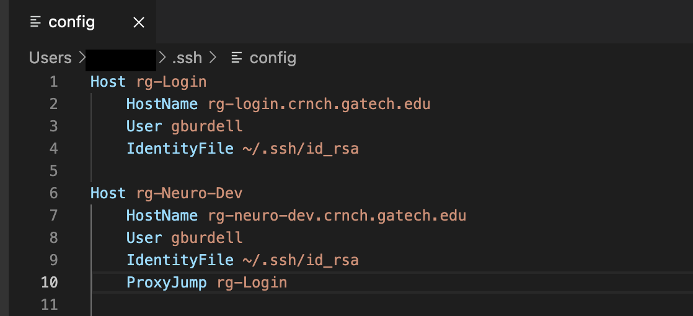

Visual Studio Code
========================

.. note::
    For remote GUI applications, we currently recommend using `Open OnDemand <https://gt-crnch-rg.readthedocs.io/en/main/general/open-on-demand.html>`__.

You are welcome to use `Visual Studio Code (VS Code or VSC) <https://code.visualstudio.com/>`__
along with the `Remote Development Extension Pack <https://marketplace.visualstudio.com/items?itemName=ms-vscode-remote.vscode-remote-extensionpack>`__
to SSH to Rogues Gallery resources. This allows you to navigate folders
and edit code with the power and convenience of VS Code and its many excellent extensions.

.. warning::
    We highly recommend that you add a jump host to `hawksbill` and run VS Code from that node rather than on the login node, `rg-login`. Please see `this page <https://gt-crnch-rg.readthedocs.io/en/main/general/ssh-jump-hosts.html>`__ about setting up SSH jump hosts for this purpose.

Recommended Extensions Include: 

* Remote Development - Includes the Remote SSH, Remote Container, and Remote WSL extensions
* Remote SSH - required to interact with remote SSH sessions on RG
* Jupyter - can be used to interact with and execute Jupyter notebooks from VSC.

Optional Extensions May Include:

* C/C++ - C syntax highlighting
* Python - Python highlighting

VSC and SSH Config Files
--------------------------
If you use VS Code, it is recommended to set up an SSH configuration file for easy access to RG nodes.
In this way, you don't have to remember hostnames or worry about whether you are on the campus VPN or not. 

1. After installing the Remote Development Extension Pack, click the green button on the bottom left corner of the screen.
2. A dialog will open at the top, select ``Connect to Host`` then select ``Configure SSH Hosts...``.
3. You should have at least one ``config`` file listed here, if there are multiple then just select the one associated with your current user.
4. This will open the ``config`` file in the VS code editor, from here follow this format to add a host to your file:

.. code:: bash

    Host rg-Login
    HostName rg-login.crnch.gatech.edu
    User gburdell

.. code:: bash

    Host rg-Neuro-Dev
    HostName rg-neuro-dev.crnch.gatech.edu
    User gburdell
    ProxyJump rg-Login
    

This has added ``rg-login``, and below that ``rg-neuro-dev``. Pay special notice to the ``ProxyJump`` 
option which will route your connection to ``rg-neuro-dev`` through ``rg-login`` first. 

Now, if you select that green button again, then ``Connect to Host``, you can pick either ``rg-login`` or ``rg-neuro-dev`` as options.

VSC with Jupyter Notebooks
--------------------------
.. figure:: ../figures/general/vsc/vscode-rg-jupyter-nb.png
   :alt:

*Special Thanks to our Contributing Authors for this Page*: James Wood
