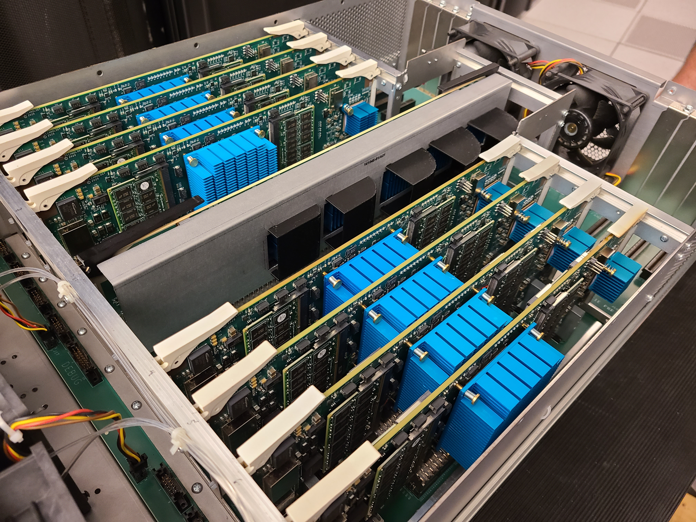
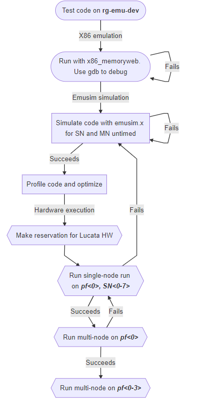

Lucata Pathfinder Getting Started
============

The Rogues Gallery hosts two distinct systems from Lucata (formerly known as Emu Technology): The Gen1 Emu Chick, an 8-node desktop-style system, and the Lucata Pathfinder, a four-chassis system with 16 nodes and 24 cores in each node for a total of 768 cores across the Pathfinder cluster.

Latest Updates
-------------
* The 23.07 Pathfinder tools have been released and made the default on the Rogues Gallery testbed. See `the 3.3 Programming Guide here <https://github.gatech.edu/crnch-rg/rg-lucata-pathfinder/blob/3c24efe56e9442207a8058a8b233d05bef53ef57/docs/pathfinder/Lucata-Pathfinder-Programming-Guide-v3.3.pdf>`__ (RG user account login to GT Github required) for the latest information on this toolset release.

Suggested Background and First Steps
-------------

Using the EMU simulation and compiler tools
-------------

The current toolset, documentation, and examples are available on the rg-emu-dev VM and other nodes as a module. Note that it is recommended to use the latest version of the Pathfinder toolset.

* **rg-login.crnch.gatech.edu**: primary login VM for Rogue’s Gallery. Use this VM to log in to another node for testing and simulation from off campus.
* **rg-emu-dev.crnch.gatech.edu**: VM for **Lucata compilation and simulation**
* **hawksbill.crnch.gatech.edu**: Large-memory, general-purpose node for larger Lucata-based simulations
* **pf<0-3>.crnch.gatech.edu**: Lucata Pathfinder chassis for HW execution

Lucata Workflow
--------------

When getting started, we highly recommend checking out the `Lucata Pathfinder Programming Manual <https://github.gatech.edu/crnch-rg/rg-lucata-pathfinder/blob/3c24efe56e9442207a8058a8b233d05bef53ef57/docs/pathfinder/Lucata-Pathfinder-Programming-Guide-v3.3.pdf>`__ (*requires GT Github login*) and read through Chapters 1,2,3, 5.1, 6, and 7. This will give you a basic understanding of the Cilk-based workflow and Lucata-specific APIs and tools. 

As shown in the figure above, the suggested Lucata workflow combines 1) x86 functionality testing, 2) simulation of code on a VM, 3) execution on a single node of the Pathfinder system, and 4) execution on multiple nodes and chassis.

1. Compile your code on rg-emu-dev using <memoryweb.h>  and emu-cc.sh to target x86 execution. This will run the Cilk code and emulate any data allocations specified by the Lucata APIs.
2. Simulate code on rg-emu-dev. Do debugging and initial verification here but note that simulation is slow! If you need to use a machine with more memory you can use hawksbill.crnch.gatech.edu
3. Profile your code with the simulator for small input sets.
4. Make a reservation on the Google Calendar for the Pathfinder to run jobs. We also use our Slack channel to reserve time on the Pathfinder 
5. Run your job on a single Pathfinder node (**SN<0-7>**. Verify its correctness.
6. Run your job on a single Pathfinder chassis (8 nodes PF<0-1>).
7. Run your job on multiple Pathfinder chassis (2 chassis).

Tutorials and Training
-------------

Please check out the recent `Pathfinder tutorial <https://github.com/gt-crnch-rg/lucata-pathfinder-tutorial>`__
for official training material for the Pathfinder systems. There are also some examples and related tools 
shared in a Github repo at https://github.gatech.edu/crnch-rg/emu-common (requires login). Please feel free to branch and fork as makes sense for your research.

Eric Hein has also contributed a nice micro-benchmark that uses serial and recursive spawn. `Micro benchmark <https://github.gatech.edu/crnch-rg/emu-microbench>`__

Other resources:
----------------
-  The `GraphBLAS branch can be found here <https://github.gatech.edu/crnch-rg/LucataGraphBLAS>`__

-  CilkPlus can also be run on CPU-based clusters. For more information
   on general CilkPlus check out the official
   `website <https://www.cilkplus.org/>`__ and other `Cilk
   tutorials <http://faculty.knox.edu/dbunde/teaching/cilk/>`__.

-  See our Kokkos
   `branch <https://github.com/jyoung3131/kokkos/tree/cilkplus>`__
   focused on CilkPlus and eventually on an Emu backend. For more
   information on Kokkos, check out their
   `website <https://github.com/kokkos>`__,
   `tutorials <https://github.com/kokkos/kokkos-tutorials>`__, and other
   documentation.
