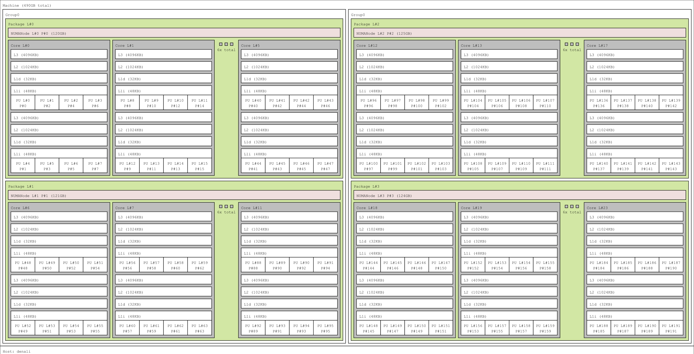

========================
Denali - Power10
========================

Acknowledgments
===============
The Denali system is funded via GT's Techfee program, so usage for this server is reserved for coursework (when requested by instructors or students). Please read more about Techfee hardware `on this page <https://crnch-rg.cc.gatech.edu/tech-fee-hosted-equipment/>`__. This system was funded in FY2024 through the efforts of Will Powell.

What's Interesting About This Hardware?
=======================================
Denali is a Power10 PowerPC based server using the Power E1080 chip, which provides the top-of-the-line Power10 CPU with Matrix-Multiply Assist, which can be used for `AI inferencing <https://developer.ibm.com/blogs/run-ai-inferencing-on-power10-leveraging-mma/>`__. 

Current Status
==============
Denal is is available for general usage. 

BUGS / Feature Requests
-----------------------

- N/A

System Specifications
=====================

The following figure shows the output from lstopo for this system. 

.. list-table:: 
    :widths: auto
    :header-rows: 1
    :stub-columns: 1

    * - Queues
      - CPU
      - Memory (GB)
      - Network
      - Cards
      - Notes
    * - rg-nextgen-hpc
      - 1x `IBM Power 10 DCM-EPGW variant, 2.9 G  <https://en.wikipedia.org/wiki/Power10>`__
      - 512 GB DDR4
      - Connect-X 5
      - 
      -       

Software and Tools
==================

.. list-table::
    :widths: auto
    :header-rows: 1
    :stub-columns: 1

    * - Distro
      - Kernel
      - Standard Compilers
      - Other Compilers
      - MPI
      - Miscellaneous
    * - RHEL9
      - 5.14.0
      - GCC 11.4.1
      - 
      - 
      - 

How do I get to Denali?
=======================

As with most CRNCH resources, you need to either log in via the gateway
node, rg-login, or access the system from the campus network via VPN or
an on-campus connection. 

To request an allocation using slurm:

.. code::

    //Request an allocation of 1 hr, partition rg-nextgen-hpc, and specify the node name for the server with -w
    salloc -t 1:00:00 -p rg-nextgen-hpc -w denali
  

Vendor-provided Documents and Resources
---------------------------------------
- `Matrix-Multiply Assist (MMA) Best Practices Guide <https://www.redbooks.ibm.com/redpapers/pdfs/redp5612.pdf>`__
